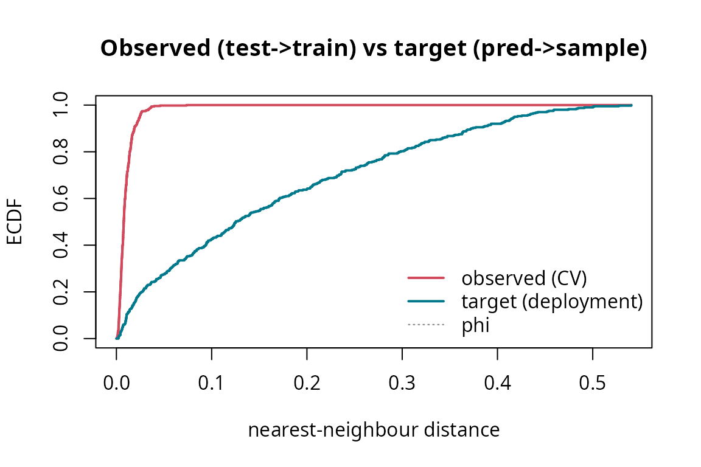

# Detecting and quantifying spatial leakage with spLeakage

`spLeakage` **audits** a train/test split: it does not generate folds
(that space is covered by `CAST`, `blockCV`, `spatialsample`). Given a
split, a prediction target, and the data, it answers three questions:

1.  **Is there leakage, and how much?** — the signed Spatial Leakage
    Index (`SLI`).
2.  **So how inflated are my numbers?** —
    [`estimate_optimism()`](../reference/estimate_optimism.md).
3.  **What should I have done?** —
    [`recommend_validation()`](../reference/recommend_validation.md).

The guiding idea: *leakage and optimism are only well-posed relative to
a declared sampling design, estimand, and prediction target.*

``` r

library(spLeakage)
```

## A clustered sample (the canonical leakage regime)

``` r

set.seed(3)
nc <- 8
centers <- cbind(runif(nc, 0.1, 0.9), runif(nc, 0.1, 0.9))
cl <- sample(nc, 500, replace = TRUE)
xy <- centers[cl, ] + cbind(rnorm(500, 0, 0.04), rnorm(500, 0, 0.04))
d <- data.frame(x = pmin(pmax(xy[, 1], 0), 1), y = pmin(pmax(xy[, 2], 0), 1))
d$z <- sin(2 * pi * d$x) + cos(2 * pi * d$y) + rnorm(500, 0, 0.15)
```

We will map wall-to-wall over the unit square:

``` r

s <- seq(0.025, 0.975, length.out = 20)
tgt <- prediction_target(grid = as.matrix(expand.grid(x = s, y = s)), type = "grid")
```

## 1. Detect leakage in a random 80/20-style 10-fold split

``` r

folds <- sample(rep_len(1:10, nrow(d)))
lk <- detect_leakage(d, split = folds, target = tgt, response = "z",
                     coords = c("x", "y"), n_boot = 300)
lk
#> <leakage_diagnosis>
#>   target            : grid   |  n = 500, test = 500, folds = 10
#>   SLI_rho (signed)  : +0.138   [OPTIMISTIC leakage]  90% CI [+0.106, +0.185]
#>   SLI_d  (signed)   : +0.053   (A = +0.1539, phi = 2.883)  90% CI [+0.040, +0.076]
#>   retained corr.    : c_obs = 0.990 vs c_pred = 0.852
#>   W (NNDM) / delta  : 0.1539 / +1.00
plot(lk)          # observed (CV) vs target (deployment) NN-distance ECDFs
```



A positive `SLI_rho` whose interval excludes zero means the split is
optimistically leaking. `plot(lk, which = "map")` shows *where*.

## 2. Quantify the optimism

``` r

opt <- estimate_optimism(d, split = folds, response = "z", coords = c("x", "y"),
                         control = "block")
opt
#> <optimism_estimate>
#>   metric / control  : RMSE / block
#>   user CV error     : 0.1965
#>   controlled error  : 0.4364
#>   optimism          : +0.2399  (+55.0% of controlled)  [OPTIMISTIC (reported accuracy inflated)]
```

The reported (random-CV) error is compared against a leakage-controlled,
design-matched scheme. The gap is the optimism — here a large positive
inflation.

## 3. Get a design-aware recommendation

Declare the estimand and design (the design *cannot* be inferred from
coordinates):

``` r

recommend_validation(d, estimand = "prediction", design = "clustered",
                     target = "grid", coords = c("x", "y"))
#> <validation_recommendation>
#>   estimand / design / target : prediction / clustered / grid
#>   spatial CV appropriate     : YES
#>   recommended:
#>     - NNDM / kNNDM CV
#>     - Spatial block CV
#>   avoid: Random k-fold CV (optimistic under spatial autocorrelation)
#>   clustering flag (risk only): NN index = 0.71 (clustered)
#>   rationale: Conditional predictive skill from a clustered sample for a 'grid' target: match the CV geometry to deployment (NNDM/kNNDM/buffered) so test points are as far from training as prediction points are from the sample.
```

For a **probability sample** the advice flips — random CV becomes
correct and spatial CV is over-pessimistic:

``` r

recommend_validation(estimand = "prediction", design = "probability", target = "grid")
#> <validation_recommendation>
#>   estimand / design / target : prediction / probability / grid
#>   spatial CV appropriate     : NO
#>   recommended:
#>     - Random CV (unbiased for a probability sample)
#>   avoid: Forcing spatial CV (over-pessimistic here)
#>   rationale: For a probability sample, random CV gives unbiased predictive skill; spatial CV would be pessimistic.
```

## Put it together: a scorecard

``` r

rec <- recommend_validation(d, estimand = "prediction", design = "clustered",
                            target = "grid", coords = c("x", "y"))
report_leakage(lk, optimism = opt, recommendation = rec)
#> ================ spLeakage report ================
#>  Leakage grade : C
#> --------------------------------------------------
#> <leakage_diagnosis>
#>   target            : grid   |  n = 500, test = 500, folds = 10
#>   SLI_rho (signed)  : +0.138   [OPTIMISTIC leakage]  90% CI [+0.106, +0.185]
#>   SLI_d  (signed)   : +0.053   (A = +0.1539, phi = 2.883)  90% CI [+0.040, +0.076]
#>   retained corr.    : c_obs = 0.990 vs c_pred = 0.852
#>   W (NNDM) / delta  : 0.1539 / +1.00
#> 
#> <optimism_estimate>
#>   metric / control  : RMSE / block
#>   user CV error     : 0.1965
#>   controlled error  : 0.4364
#>   optimism          : +0.2399  (+55.0% of controlled)  [OPTIMISTIC (reported accuracy inflated)]
#> 
#> <validation_recommendation>
#>   estimand / design / target : prediction / clustered / grid
#>   spatial CV appropriate     : YES
#>   recommended:
#>     - NNDM / kNNDM CV
#>     - Spatial block CV
#>   avoid: Random k-fold CV (optimistic under spatial autocorrelation)
#>   clustering flag (risk only): NN index = 0.71 (clustered)
#>   rationale: Conditional predictive skill from a clustered sample for a 'grid' target: match the CV geometry to deployment (NNDM/kNNDM/buffered) so test points are as far from training as prediction points are from the sample.
#> ==================================================
```
